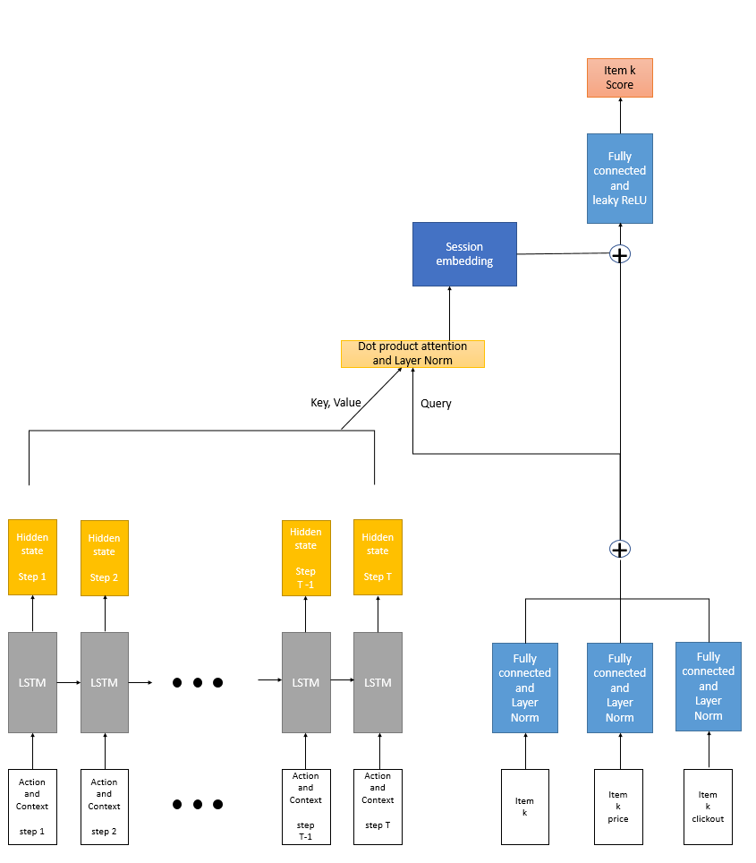
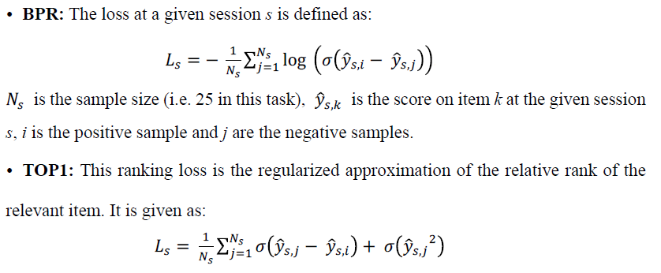
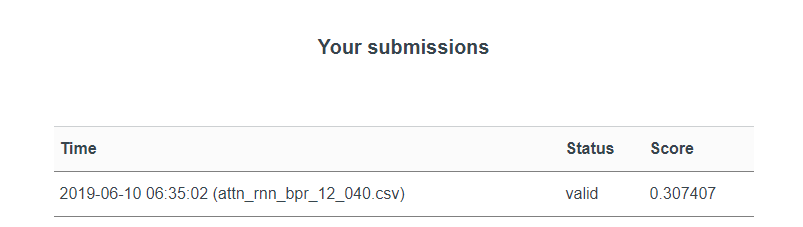

# RecSys Challenge 2019 : recomendation system based RNN with attention 

This repository has models and preprocessing codes to participate in the [RecSys Challenge 2019](http://www.recsyschallenge.com/2019/).

## Problem definition

For details about the problem definition, data sets, and evaluation metric please refer to [trivago's RecSys Challenge website](https://recsys.trivago.cloud/) or take a look [HERE](docs/problem_definition.md).

## Requirements
- pytorch >= 1.0.0
- numpy >= 1.16.2
- pandas >= 0.24.1
- pyyaml >= 3.13

## File descriptions
* `src/data_loader/preprocess.py` : preprocesses data csv files to utilize for recommendation.
* `src/data_loader/recsys_dataset.py` : loads preprocessed data for deep learning model training and test.
* `src/models/attention_rnn.py` : contains recommendation model based RNN with attention module.
* `src/train_test/rnn_train_test.py` : for training and test.
* [`src/baseline_algorithm/rec_popular.py`](https://github.com/recsyschallenge/2019) : contains a baseline algorithm that predicts the most popular items in the training set.
* [`src/verify_submission/verify_subm.py`](https://github.com/recsyschallenge/2019) : contains a script to verify the format of the submission.
* [`src/score_submission/score_subm.py`](https://github.com/recsyschallenge/2019) : contains an example script that illustrates the scoring method used in the challenge.

## Recommendation System based RNN with Attention
The goal of this model is to calculate the scores of the items for a session and recommend based on that score.
The action sequence of the session is embedded using LSTM. 
An item embedding is calculated utilizing the meta information of the item.
It extracts important information from the session through dot product attention using item embedding as query, and action sequence embedding as key and value.
The item score is calculated using this information and item embedding. 
The scores of the items are utilized for recommendation. 

## Training Loss
To make the model's score meaningful, the model is learned through the following losses.

## Test Result
The figure below shows the result of submitting test file recommeded by RNN with Attention learned with BPR loss.
Though it showed better performance than baseline, performance improvemetn is needed. 

